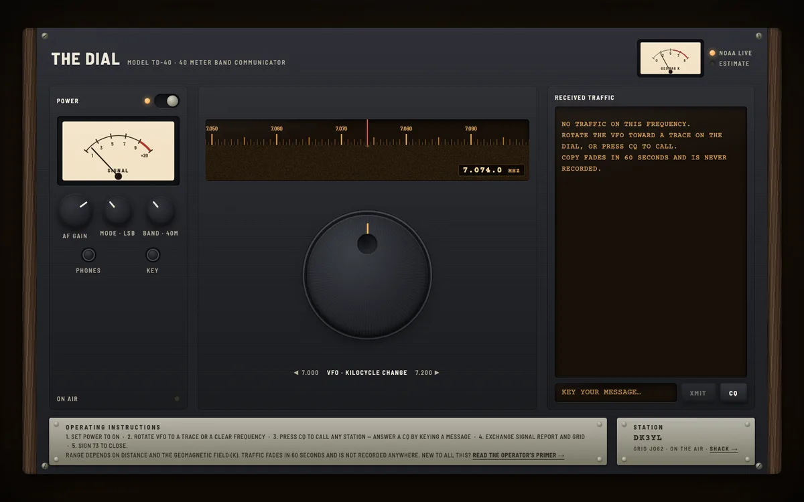
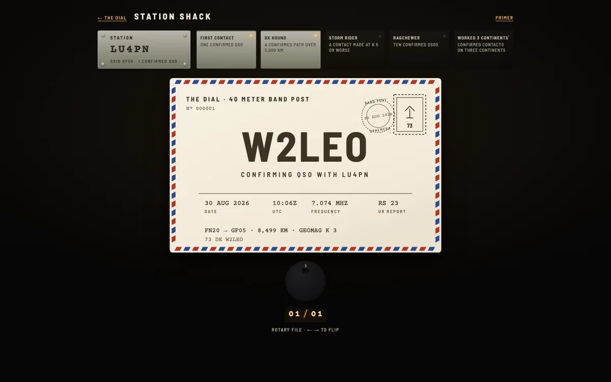
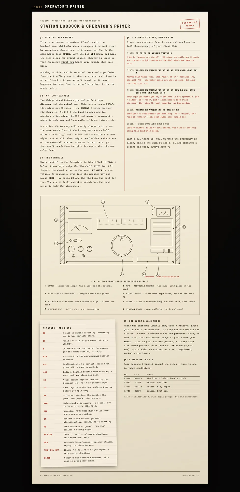

# THE DIAL

**An ephemeral radio band on the web.** Whoever is tuned to your frequency
*right now* hears you. Nobody else ever will.



## What is this

Ham radio, without the radio. You get a callsign, a hundred-year-old set of
manners, and a shared band of frequencies rendered as one big 1970s rig.
Flip **POWER** — the lamps warm up, static fades in — and spin the VFO. The
bright traces on the dial glass are people. Tune into one and their words
surface in the traffic glass, letter by letter, as clean as the path between
you allows.

Then they fade. Sixty seconds, gone. There is no scrollback, no history, no
list of who's online. If you weren't tuned in, it never happened for you.
That isn't a missing feature — it's the entire point. Every contact on this
band is something you *caught*.

## The sun is the sysadmin

How far your signal carries is decided by two things: **distance** and
**the actual sun**. The server polls NOAA's live planetary K-index — real
space weather, updated through the day. On a quiet sun, Delhi reaches Paris.
During a geomagnetic storm, the long paths collapse and the same
transmission arrives as:

```
CQ ## _# D/ VU3VT VU3~~
```

…or doesn't arrive at all. Some nights the band is generous. Some nights
you'll hear nothing but beacons and static. Come back tomorrow; the
ionosphere isn't sorry.

## The ritual

Contacts follow the real choreography, and the rig teaches it to you:

```
0142Z  CQ CQ CQ DE VK2TAE VK2TAE K        ← "anyone out there?"
0143Z  VK2TAE DE VU2QXK UR RS 47 47       ← answer, report their signal
       QTH GRID ML88 HW? K
0144Z  VU2QXK DE VK2TAE UR RS 35 35 QSB   ← they copy you worse — paths
       GRID QF56 TNX FER CALL 73 K           aren't symmetric
0145Z  — BOTH STATIONS PRESS QSL —
```

When both sides confirm, a card is minted.

## The one thing that lasts



QSL cards are the only thing The Dial ever stores. Each one is generated
from the contact itself — callsigns, grids, distance, frequency, the
K-index that night — with seeded art: airmail borders, a postage stamp, a
postmark, and a red **STORM** overprint if you worked someone through K≥5.
They hang in your **shack** at `/shack/YOURCALL`, a rotary card file with
award plates: *First Contact, DX Hound, Storm Rider, Ragchewer, Worked 3
Continents.*

Your callsign is durably yours (a station token in your browser), assigned
with your country's real prefix and a coarse Maidenhead grid square — never
anything finer.

## Never a dead band

Four beacons transmit around the clock, garbled by your real path to them —
tune to **7.026** and DK0WCY will tell you the live K-index through the
static. And on **7.157**, something that never identifies itself reads
five-digit groups on a schedule. It means something. Not our department.

## New here?

The **Operator's Primer** at `/manual` assumes you know nothing: what the
band is, why copy garbles, a specimen contact annotated line by line in red
margin ink, a numbered diagram of every control, and the full glossary —
CQ, DE, K, RS, QSB, 73, and the rest of the lingo you'll hear.



## Run your own band

```bash
npm install
npm run dev        # rig on :5173, band server on :8787
```

Open http://localhost:5173 and flip POWER. To work yourself, open a second
tab at `http://localhost:5173/?op=b` — the `op` parameter runs a second
operator identity, and local connections are dealt random world locations,
so propagation is worth testing alone.

For production: `npm run build && npm run server` — one Node process serves
the client, the WebSocket band, and the shack API.

## How it works

- **One small server** (`server/`): all live state in memory. Per-pair signal
  quality = distance between grid centers × band openness (live NOAA
  K-index) × deterministic hourly fading. Text is garbled **server-side per
  recipient** — clean copy never reaches a station that couldn't have heard it.
- **One page** (`client/`): React + Vite. Canvas dial scale and waterfall,
  SVG meters with sprung needles, and every sound — band noise, tuning
  whine, carrier beat notes, RTTY warbles, the CW sidetone — synthesized in
  Web Audio. No audio files, no images, no database except the cards.

Nothing else is stored. Chat content never touches disk.

---

*73 — best regards. It's how operators say goodbye.*
